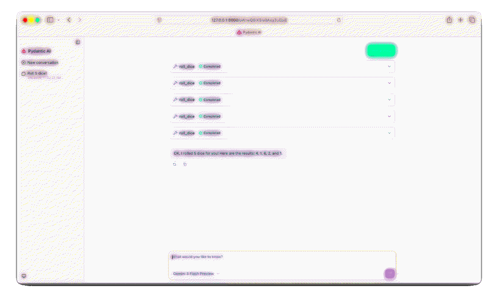

# Agent Template



This repository is a minimal template for building an AI agent using `pydantic-ai` with comprehensive documentation for coding agents and LLM-optimized guides.

## **What this template provides**

- A simple `Agent` configured in `main.py` with example tools
- Comprehensive documentation for coding agents (`llms.txt`, `AGENTS.md`, `USER_GUIDE.md`)
- **Agent Skills** support for modular, extensible capabilities
- Pre-built skills for template creation and tool generation
- LLM-optimized documentation for automated interpretation and implementation
- A browser-based chat UI with customization options

### **Requirements**

- Python 3.13 or newer
- Provider API credentials (e.g. Google, Anthropic, or OpenAI keys)

## **Create a repository from this template & setup**

Follow these numbered steps to create a new repository from the template (web) and set up locally:

1. On GitHub, open this template repository and click "Use this template" → "Create a new repository". Give the new repo a name and create it under your account or organization.

2. Clone your newly-created repository and change into the project directory (replace the URL with your repo's clone URL):

```bash
git clone https://github.com/{your-name}/{your-repo}.git
cd your-repo
```

3. Make the helper script executable and run it to create a virtual environment, install dependencies, and start the web UI:

```bash
chmod +x run_interface.sh
./run_interface.sh
```

4. Open http://127.0.0.1:8000 in your browser to interact with the agent.

5. Make changes! The chat window will automatically refresh after saving changes to the agent.

## **LLM API Configuration**

- Create a `.env` file in the project root and add the environment variables required by your chosen provider. Examples (replace values with your keys):

```env
# For Google Gemini (example)
GOOGLE_API_KEY=your_google_api_key_here

# For OpenAI (example)
OPENAI_API_KEY=your_openai_api_key_here
```

- `main.py` uses `load_dotenv()` so keys in `.env` will be loaded automatically at runtime. Edit the `Agent(...)` line in [main.py](main.py) to choose a different model or provider.

## **Usage**

- Run the helper script to prepare the environment and launch the interface:

```bash
./run_interface.sh
```

- Open http://127.0.0.1:8000 in your browser to chat with the agent and try the `roll_dice` tool.

## **📚 Documentation for Coding Agents**

This repository includes comprehensive LLM-optimized documentation:

### **Core Documentation**
- **[llms.txt](llms.txt)** - LLM-friendly repository overview and command patterns
- **[AGENTS.md](AGENTS.md)** - Agent creation patterns and command interpretation guide
- **[USER_GUIDE.md](USER_GUIDE.md)** - Complete usage patterns and implementation workflows

### **For Coding Agents**
These documents are specifically designed to help coding agents:
- **Interpret user commands** for creating Pydantic AI agents
- **Understand repository structure** and capabilities
- **Generate appropriate code** based on user requests
- **Follow best practices** for agent development

### **Quick Reference for Common Commands**

| User Request | Implementation |
|--------------|----------------|
| "Create an agent that does X" | Modify `SYSTEM_PROMPT` in `main.py` |
| "Add a tool for Y" | Create new tool with `@agent.tool_plain` decorator |
| "Use model Z" | Update models list in `agent.to_web()` call |
| "Customize interface" | Modify web configuration in `main.py` |
| "Add skills" | Install `pydantic-ai-skills` and configure `SkillsToolset` |

### **Available Skills**

#### **Template Creator Skill** (`skills/template-creator/`)
Generate complete agent templates with specialized configurations:
- Business, technical, creative, support, and research agents
- Custom system prompts and tool sets
- Model selection and interface configuration

#### **Tool Generator Skill** (`skills/tool-generator/`)
Create custom tools for agents:
- Data processing and analysis tools
- API integration tools
- File operation tools with security features
- Calculation and communication tools

## **🔧 Skills Setup (Optional)**

To enable Agent Skills functionality:

1. **Add skills dependency** to `pyproject.toml`:
```toml
dependencies = [
    "pydantic-ai>=1.54.0",
    "python-dotenv>=1.2.1",
    "uvicorn>=0.40.0",
]
```

2. **Install dependencies**:
```bash
uv sync
```

3. **Update main.py with skills integration** (see [AGENTS.md](AGENTS.md) for examples):

```python
from pydantic_ai_skills import SkillsToolset

# Initialize skills toolset
skills_toolset = SkillsToolset(directories=["./skills"])

# Add to agent
app = agent.to_web(
    models=["google-gla:gemini-3-flash"],
    toolsets=[skills_toolset]
)
```
